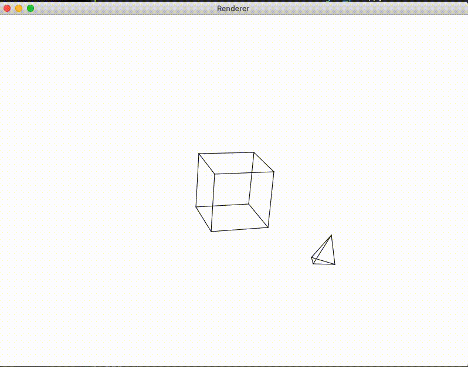

# 3D_projections
Java Program that draws a wireframe of objects and can do rotations

# Running
To run simply execute the bash script to compile and run the javafx program
(NOTE: This will only work on MacOS since the dependency directory only has the javafx version for MacOS)
<pre>sh compile_and_run.sh</pre>

## Sample
(Demo video is low fps because of .gif file format)

